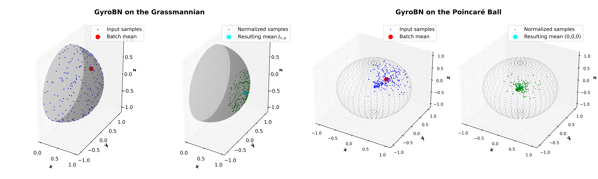
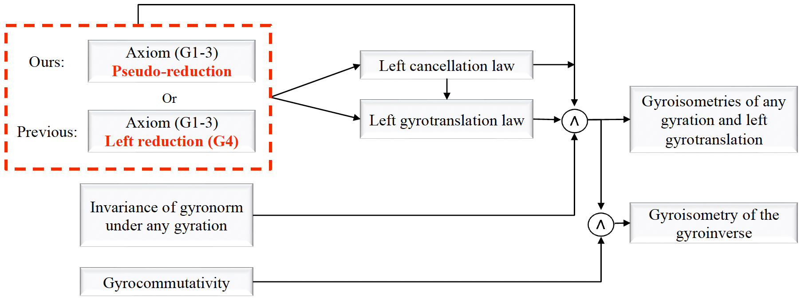
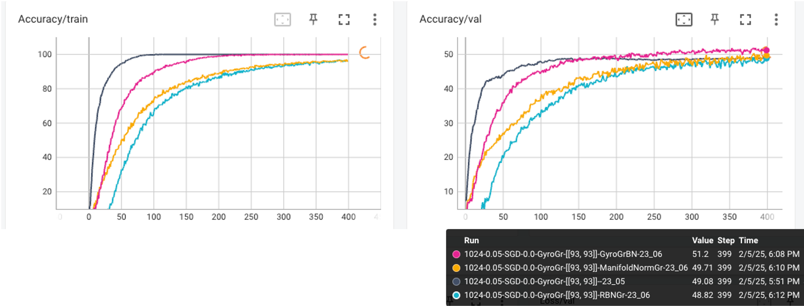
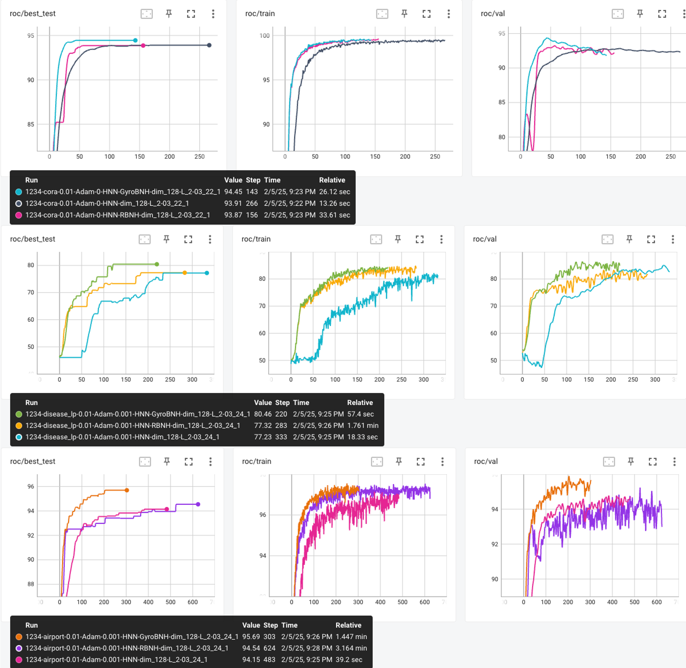

[//]: # ([</img>]&#40;https://arxiv.org/abs/2409.19433&#41;)
[</img>](https://openreview.net/forum?id=d1NWq4PjJW)
[</img>](https://openreview.net/pdf?id=d1NWq4PjJW)

# Gyrogroup Batch Normalization

<div align="center">
    <figure>
        
        <figcaption>Figure 1: Visualization of GyroBN on the Grassmann and Poincaré ball.</figcaption>
    </figure>
</div>


<div align="center">
    <figure>
        
        <figcaption>Figure 2: Conceptual illustration of our derivation on gyroisometries.</figcaption>
    </figure>
</div>

## Introduction
This is the official code for our ICLR 2025 publication: *Gyrogroup Batch Normalization*. 

If you find this project helpful, please consider citing us as follows:

```bib
@inproceedings{chen2025gyrobn,
    title={Gyrogroup Batch Normalization},
    author={Ziheng Chen and Yue Song and Xiaojun Wu and Nicu Sebe},
    booktitle={The Thirteenth International Conference on Learning Representations},
    year={2025}
}
```
As discussed in our main paper, GyroBN also naturally incorporates our previous [LieBN](https://github.com/GitZH-Chen/LieBN.git):
```bib
@inproceedings{chen2024liebn,
    title={A Lie Group Approach to Riemannian Batch Normalization},
    author={Ziheng Chen and Yue Song and Yunmei Liu and Nicu Sebe},
    booktitle={The Twelfth International Conference on Learning Representations},
    year={2024},
}
```


If you have any problem, please contact me via ziheng_ch@163.com.

## Implementations
This source code contains GyroBN on the Grassmannian and hyperbolic spaces. 
We also implemented RBN and ManifoldNorm on the Grassmannian, as shown in Tab. 3.

## Requirements

Install necessary dependencies by `conda`:

```setup
conda env create --file environment.yaml
```

**Note** that the [hydra](https://hydra.cc/) package is used to manage configuration files.

## Demos
 Demos of Grassmannian and hyperbolic GyroBN, which can be found in `demo.py`:

```python
import torch as th
from RieNets.grnets.GrBN import GyroBNGr
from Geometry.Grassmannian import GrassmannianGyro
from RieNets.hnns.layers.GyroBNH import GyroBNH
from frechetmean import Poincare

# --- Typical use of Grassmannian GyroBN
bs, c, n, p = 32, 8, 30, 10
grassmannian = GrassmannianGyro(n=n, p=p)
random_data = grassmannian.random(bs, c, n, p)
rbn = GyroBNGr(shape=[c, n, p])
output_grassmann = rbn(random_data)

# --- Typical use of hyperbolic GyroBN in the Poincaré ball
random_euclidean_vectors = th.randn(bs, n)/10
poincare_ball = Poincare() 
random_hyperbolic_data = poincare_ball.projx(random_euclidean_vectors)  # Generate random points in the Poincaré ball

rbn_h = GyroBNH(dim=n,manifold=poincare_ball)  # Initialize GyroBNH for hyperbolic normalization
output_hyperbolic = rbn_h(random_hyperbolic_data)  # Apply GyroBNH

# Print shape to verify outputs
print("Grassmannian BN output shape:", output_grassmann.shape)
print("Hyperbolic BN output shape:", output_hyperbolic.shape)
```
## Running Experiments

### Dataset
The preprocessed Grassmannian from the HDM05 dataset can be found [here](https://www.dropbox.com/scl/fi/chzvrg3srq6jwntqlr8n4/HDM05_Grassmannian.zip?rlkey=r4b87nybepv58bu8re14jp57d&st=vyy888lc&dl=0). 
The link prediction datasets can be found [here](https://www.dropbox.com/scl/fi/5rm3lwp367spd58xp1vil/Graph-LP.zip?rlkey=t32yiestqmqfdcuodqax8n4ny&st=lqbd8x3m&dl=0).
Please download the datasets and put them in your folder.
If necessary, change the `path` in `conf/dataset/HDM05.yaml` and `conf/dataset/LP.yaml`,

### Grassmannian
Please run this command for the main experiments on the HDM05 (Tab. 3):
```train
bash exp_grassmannian.sh
```
Please run this command for the KBlock ablations on the HDM05 (Tab. 4):
```train
bash exp_grassmannian_ablations.sh
```
The tensorboard results on the HDM05 under 1-block architecture:



**Note:** You can change the `path` in `exp_xxx.sh`, which will override the hydra config.

### Hyperbolic
Please run this command for HNN with or without GyroBN-H or RBN-H on the link prediction task. (Tab. 5):
```train
bash exp_hyperbolic.sh
```
ROC on three typical link prediction datasets:



### Visualization

Visualization code can be found in `./Visualization/gyrobn_gras_hyperbolic.py`, corresponding to Fig. 1.


